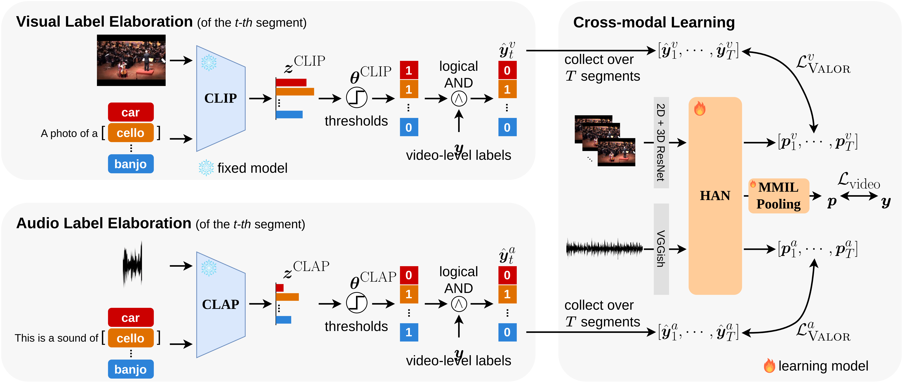

# Modality-Independent Teachers Meet Weakly-Supervised Audio-Visual Event Parser

This is the official repository of NeurIPS 2023 paper [VALOR](https://arxiv.org/abs/2305.17343).



[**Modality-Independent Teachers Meet Weakly-Supervised Audio-Visual Event Parser**](https://arxiv.org/abs/2305.17343)
<br/>[Yung-Hsuan Lai](https://github.com/Franklin905), [Yen-Chun Chen](https://github.com/ChenRocks), [Yu-Chiang Frank Wang](https://vllab.ee.ntu.edu.tw/ycwang.html)<br/>


## Machine environment
- Ubuntu version: 20.04.6 LTS
- CUDA version: 11.4
- Testing GPU: NVIDIA GeForce RTX 3090


## Requirements
A [conda](https://conda.io/) environment named `valor` can be created and activated with:

```bash
conda env create -f environment.yaml
conda activate valor
```


## Dataset setup

We recommend directly work with our pre-extracted features for simplicity. If you still wish to run feature extraction and pseudo-label generation yourself, please follow the below optional instructions.
<details><summary>Video downloading (optional)</summary>
   One may download the videos listed in a csv file with the following command. We provide an example.csv to demonstrate the process of downloading a video.
   
   ```bash
   python ./utils/download_dataset.py --videos_saved_dir ./data/raw_videos --label_all_dataset ./data/example.csv
   ```
   
   After downloading the videos to `data/raw_videos/`, one should extract video frames in 8fps from each video with the following command. We show the frame extraction of the video downloaded from the above command.
   
   ```bash
   python ./utils/extract_frames.py --video_path ./data/raw_videos --out_dir ./data/video_frames
   ```

   However, there are some potential issues when using these downloaded videos. For more details, please see [here](video_issues.md).
</details>


### LLP dataset annotations
Please download LLP dataset annotations (6 csv files) from [AVVP-ECCV20](https://github.com/YapengTian/AVVP-ECCV20/tree/master/data) and put in `data/`.

### Pre-extracted features
Please download audio features (VGGish), 2D visual features (ResNet152), and 3D visual features (ResNet (2+1)D) from [AVVP-ECCV20](https://github.com/YapengTian/AVVP-ECCV20) and put in `data/feats/`

### CLIP features & segment-level pseudo labels
Option 1. Please download visual features and segment-level pseudo labels from CLIP from this [link](https://huggingface.co/datasets/NTUBarista/valor_features/blob/main/CLIP.zip), put in `data/`, and unzip the file with the following command:
```bash
unzip CLIP.zip
```

<details><summary> Option 2 </summary>

The visual features and pseudo labels can also be generated with the following command if the video frames from all videos are prepared in `data/video_frames/`:

```bash
python ./utils/clip_preprocess.py --print_progress
```
For example, the features and pseudo labels of the video downloaded above can be generated in `data/example_v_feats/` and `data/example_v_labels/`, respectively, with the following command:
```bash
python ./utils/clip_preprocess.py --label_all_dataset ./data/example.csv --pseudo_labels_saved_dir ./data/example_v_labels --visual_feats_saved_dir ./data/example_v_feats --print_progress
```
</details>

### CLAP features & segment-level pseudo labels
Option 1. Please download audio features and segment-level pseudo labels from CLAP from this [link](https://huggingface.co/datasets/NTUBarista/valor_features/blob/main/CLAP.zip), put in `data/`, and unzip the file with the following command:
```bash
unzip CLAP.zip
```
<details><summary>Option 2</summary>

The audio features and pseudo labels can also be generated with the following command if raw videos are prepared in `data/raw_videos/`:

```bash
python ./utils/clap_preprocess.py --print_progress
```
For example, the features and pseudo labels of the video downloaded above can be generated in `data/example_a_feats/` and `data/example_a_labels/`, respectively, with the following command:
```bash
python ./utils/clap_preprocess.py --label_all_dataset ./data/example.csv --pseudo_labels_saved_dir ./data/example_a_labels --audio_feats_saved_dir ./data/example_a_feats --print_progress
```

</details>

### File structure for dataset and code
Please make sure that the file structure is the same as the following.

   <details><summary>File structure</summary>

   ```
   > data/
       ├── AVVP_dataset_full.csv
       ├── AVVP_eval_audio.csv
       ├── AVVP_eval_visual.csv
       ├── AVVP_test_pd.csv
       ├── AVVP_train.csv
       ├── AVVP_val_pd.csv
       ├── feats/
       │     └── r2plus1d_18/
       │     └── res152/
       │     └── vggish/
       ├── CLIP/
       │     └── features/
       │     └── segment_pseudo_labels/
       ├── CLAP/
       │     └── features/
       │     └── segment_pseudo_labels/
       ├── video_frames/ (optional)
       │     └── 00BDwKBD5i8/
       │     └── 00fs8Gpipss/
       │     └── ...
       └── raw_videos/ (optional)
             └── 00BDwKBD5i8.mp4
             └── 00fs8Gpipss.mp4
             └── ...
   ```

   </details>


## Download trained models
Please download the trained models from this [link](https://huggingface.co/NTUBarista/valor_trained_models/tree/main) and put the models in their corresponding model directory.

   <details><summary>File structure</summary>

   ```
   > models/
       ├── model_VALOR/
       │        └── checkpoint_best.pt
       ├── model_VALOR+/
       │        └── checkpoint_best.pt
       └── model_VALOR++/
                └── checkpoint_best.pt
   ```

   </details>


## Training
We provide some sample scripts for training VALOR, VALOR+, and VALOR++.

### VALOR
```bash
bash scripts/train_valor.sh
```

### VALOR+

```bash
bash scripts/train_valor+.sh
```

### VALOR++

```bash
bash scripts/train_valor++.sh
```


## Evaluation
**Note**: If you are evaluating the trained models generated with the  training scripts, change `--model_name model_VALOR` to `--model_name model_VALOR_reproduce` [here](https://github.com/Franklin905/VALOR-private/blob/e0d7116d7fcf2e414e87dbf788a462793f3fa9ce/scripts/test_valor.sh#L4).

### VALOR
```bash
bash scripts/test_valor.sh
```

### VALOR+

```bash
bash scripts/test_valor+.sh
```

### VALOR++

```bash
bash scripts/test_valor++.sh
```


## Acknowledgement
We build VALOR codebase heavily on the codebase of [AVVP-ECCV20](https://github.com/YapengTian/AVVP-ECCV20) and [MM-Pyramid](https://github.com/JustinYuu/MM_Pyramid). We sincerely thank the authors for open-sourcing! We also thank [CLIP](https://github.com/openai/CLIP) and [CLAP](https://github.com/LAION-AI/CLAP) for open-sourcing pre-trained models.

## Citation
If you find this code useful for your research, please consider citing:
```bibtex
@inproceedings{lai2023modality,
  title={Modality-Independent Teachers Meet Weakly-Supervised Audio-Visual Event Parser},
  author={Yung-Hsuan Lai, Yen-Chun Chen, Yu-Chiang Frank Wang},
  booktitle={NeurIPS},
  year={2023}
}
```

## License
This project is released under the MIT License.
